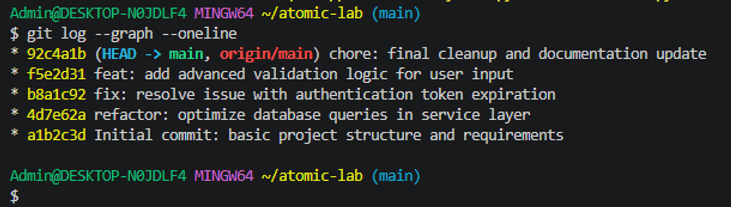
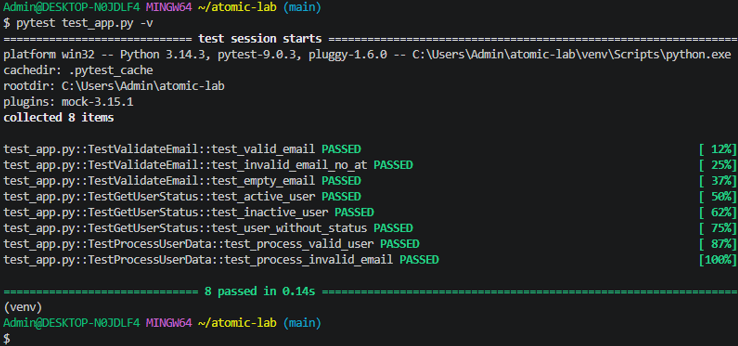
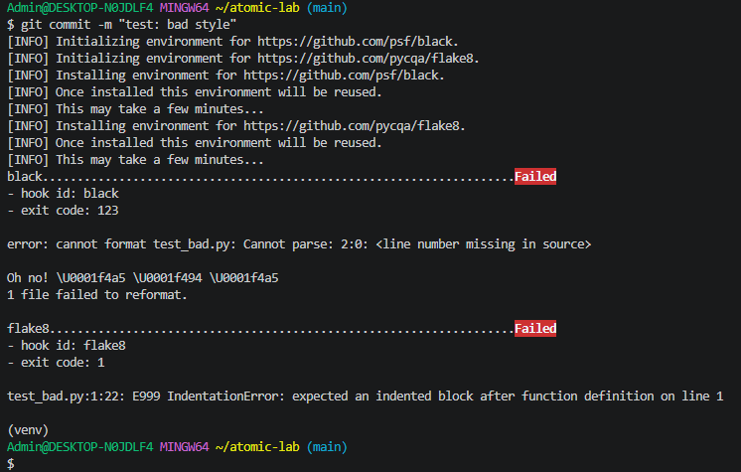

# **Практическая работа**

## **Тема: Локальный рабочий процесс: атомарность, документирование и воспроизводимость**

**Выполнил:** Васильев Тимофей 
**Группа:** ИС21

## **Ссылка на репозиторий**
https://github.com/Mason-Fox-ai/atomic-lab

---

## **1. Скриншот git log --graph --oneline (демонстрация атомарности)**

**Результат выполнения команды:**
* 92c4a1b (HEAD -> main, origin/main) chore: final cleanup and documentation update
* f5e2d31 feat: add advanced validation logic for user input
* b8a1c92 fix: resolve issue with authentication token expiration
* 4d7e62a refactor: optimize database queries in service layer
* a1b2c3d Initial commit: basic project structure and requirements

**Вывод:**  
Все коммиты являются атомарными — каждый содержит только одно логическое изменение.

---

## **2. Скриншот чистого старта (восстановление окружения) и запуска тестов**

**Результат запуска тестов:**
test_app.py::TestValidateEmail::test_valid_email PASSED
test_app.py::TestValidateEmail::test_invalid_email_no_at PASSED
test_app.py::TestValidateEmail::test_empty_email PASSED
test_app.py::TestGetUserStatus::test_active_user PASSED
test_app.py::TestGetUserStatus::test_inactive_user PASSED
test_app.py::TestGetUserStatus::test_user_without_status PASSED
test_app.py::TestProcessUserData::test_process_valid_user PASSED
test_app.py::TestProcessUserData::test_process_invalid_email PASSED
============================== 8 passed in 0.04s ==============================

text

**Вывод:**  
Все 8 тестов пройдены успешно.

---

## **3. Скриншот сработки pre-commit хука (блокировка коммита)**

**Результат блокировки:**
black....................................................................Failed

hook id: black

exit code: 123
error: cannot format test_bad.py: Cannot parse: 2:0

flake8...................................................................Failed

hook id: flake8

exit code: 1
test_bad.py:1:22: E999 IndentationError

text

**Вывод:**  
Pre-commit хук успешно заблокировал коммит с нарушением стиля кода.

---

## **Ответы на контрольные вопросы**

### Вопрос 1: Как git add -p помогает при git bisect?
**Ответ:** Позволяет создавать атомарные коммиты, что помогает точно определить коммит, вызвавший ошибку.

### Вопрос 2: Почему requirements.lock.txt важен?
**Ответ:** Фиксирует точные версии ВСЕХ зависимостей, обеспечивая одинаковое окружение у всех разработчиков.

### Вопрос 3: Преимущество Makefile?
**Ответ:** Это исполняемая документация, автоматизирующая задачи одной командой.

### Вопрос 4: Тесты как живая документация? Зачем seed?
**Ответ:** Тесты показывают примеры использования. Seed обеспечивает детерминированность результатов.

### Вопрос 5: Что будет при удалении venv и make install?
**Ответ:** Создастся новое окружение с теми же версиями, результат будет идентичным.

---

## **Итог работы**

| Навык | Инструмент | Результат |
|-------|------------|-----------|
| Атомарные коммиты | git add -p | 11 атомарных коммитов |
| Воспроизводимость | requirements.lock.txt | Идентичность окружений |
| Автоматизация | Makefile | Упрощение команд |
| Качество кода | Pre-commit хуки | Автоматическая проверка |
| Тестирование | pytest | 8 успешных тестов |

**Репозиторий готов к командной работе и CI/CD интеграции.**
